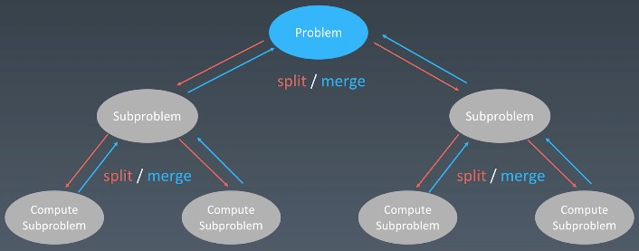

# 递归
通过函数体调用自己，来实现循环

## 特点
1. 方法内部调用自己
2. 必须要有一个明确的结束条件
3. 通过参数进行函数不同层之间的变量传递
4. 除了参数和全局变量之外，每一层之间互不影响
5. 递归调用过程中，系统为每一层的返回点、局部变量等开辟了栈来存储

## 缺点
1. 因为每次调用都需要在栈内存中分配空间，以保存参数、返回地址、临时变量，效率低
```
    但以现在设备的配置，该问题可以忽略
```
2. 递归层次过多会造成栈溢出
3. 递归中存在多次计算的问题
```
    可通过设置缓存来避免重复计算
```

## 递归状态树


## 代码模板
java:
```
public void recur(int level, int param) {
    // recursion terminator  递归终止条件
    if (level > MAX_LEVEL) {
        // process result
        return;
    }

    // process logic in current level  处理逻辑
    process(level, param);

    // drill down  下到下一层
    recur( level: level + 1, newParam);

    // reverse the current level status if needed  清理当前层
}
```

## 思维要点
1. 拒绝人肉递归
```
    熟练以后，不需要再画递归状态树
```
2. 找到最近最简的方法，将其拆解成可重复解决的子问题
3. 使用数学归纳法思维

# 分治
分治实际上也是一种递归。分治的递归状态树是将一个问题化解成多个子问题。对于复杂算法，需要找重复性，将复杂问题分解成若干个子问题

## 代码模板
java:
```
private static int divide_conquer(Problem problem, ) {
    // recursion terminator  终止条件
    if (problem == NULL) {
        int res = process_last_result();
        return res;
    }

    // prepare data  处理当前落，将大问题分解成子问题
    data = prepare_data(problem)
    subProblems = split_problem(problem, data)

    // conquer subproblems  下探到下一层，解决更细节的子问题
    res0 = divide_conquer(subProblems[0])
    res1 = divide_conquer(subProblems[1])

    // process and generate the final result  组装结果，然后返回
    result = process_result(res0, res1);

    // revert the current level states  清理当前层
}
```

# 回溯
使用递归实现，属于递归的一种情况

## 定义
采用试错的思想，在分布解决过程中，如果尝试发现现有的分布答案不能得到有效的正确答案时，取消上一步甚至上几步的操做，再通过其他可能的分布解答再次尝试寻找问题的答案

## 最终的结果
1. 找到可能存在的答案
2. 在尝试了所有可能的分布方法后宣告改问题没有答案

最坏的情况，会导致一次复杂度为指数时间的计算

## 典型应用
1. 八皇后
2. 数独


