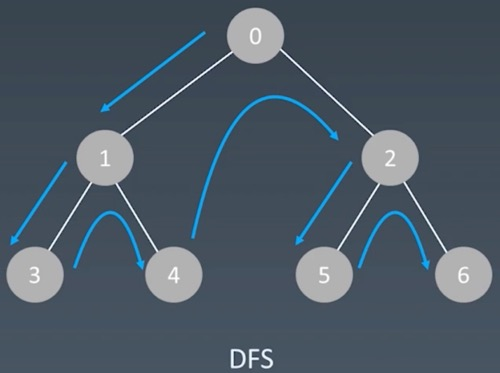
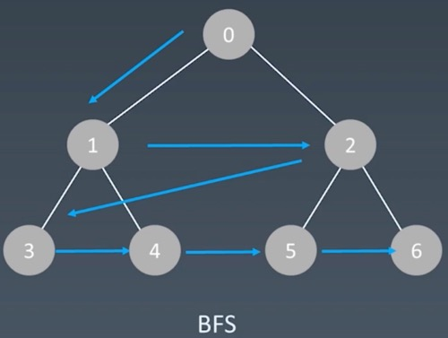

# 搜索需要做的事情
每个节点都要访问一次，且每个节点仅仅要访问一次。根据对节点的访问顺序不同，可分为 `深度优先搜索` 和 `广度优先搜索`

## 深度优先搜索 DFS

### 遍历示例图


### 遍历顺序
1. 从根节点开始遍历
2. 然后下转到下一层
```
二叉树：下转到左子树
图：下转到与当前节点连通的相连节点
多叉树：下转到children节点
```
3. 一直下转，走到底
4. 然后不断返回上一层，再依次下转到其他节点
```
二叉树：下转到右子树
图：下转到与当前节点连通的其他相连节点
多叉树：下转到其他children节点
```
5. 依次操作，直至所有节点都访问完毕


### 特点
不会等循环走完，就会扩到新的一层里面去

### 递归方式遍历
深度优先常用方式
1. 递归终止条件
2. 处理当前层
3. 下转到下一层

#### python代码模板
```
visited = set()

def dfs(node, visited):
    # recursion terminator
    if node in visited:
        # already visited
        return

    visited.add(node)

    # process current node here.
    ...
    for next_node in node.children():
        if next_node not in visited:
            #drill down
            dfs(next_node, visited)
```

### 循环方式遍历
需要手动维护一个栈，通过栈来遍历各个节点，模拟递归的流程

#### python代码模板
```
def DFS(self, tree):

    if tree.root is None:
        return []

    visited, stack = [], [tree.root]

    while stack:
        node = stack.pop()
        visited.add(node)

        process (node)
        nodes = generate_related_nodes(node)
        stack.push(nodes)

    # other processing work
    ...
```

## 广度优先搜索 BFS

### 遍历示例图


### 遍历方式
使用队列，按每一层向下扩散

### python代码模板
```
def BFS(graph, start, end):
    visited = set()
    queue = []
    queue.append([start])
    while queue:
        node = queue.pop()
        visited.add(node)
        process(node)
        nodes = generate_related_nodes(node)
        queue.push(nodes)
    # other processing work
    ...
```

# 贪心算法 Greedy
一种在每一步中都采取在当前状态下最好或最优(最有利)的选择，从而希望导致结果是全局最好或最优的算法
## 存在的问题
1. 每一步最优，是否一定全局最优？
```
当下情况找最优，并一定能够达到全局最优的情况
对于工程和生活中，贪心算法一般不能得到我们所需要的结果
```

## 适用贪心算法的场景
1. 问题能够分解成子问题
2. 子问题的最优解能递推到最终问题的最优解
```
这种子问题最优解称为 最优子结构
```

## 与动态规划的不同
1. 贪心算法对每个子问题的解决方案都要做出选择，且不能回退
2. 动态规划会保存以前的运算结果，并根据以前的结果对当前进行选择，有回退功能

## 总结
1. 一旦一个问题可通过贪心算法来解决，那么贪心算法一般是解决这个问题的最好办法
2. 由于贪心算法的高效性以及其所求得的答案比较接近最优结果，贪心算法也可以用作辅助算法或者直接解决一些要求结果不特别明确的问题

## 算法应用
1. [分发饼干](https://leetcode-cn.com/problems/assign-cookies/)
2. [买卖股票最佳时机](https://leetcode-cn.com/problems/best-time-to-buy-and-sell-stock-ii/)
3. [跳跃游戏](https://leetcode-cn.com/problems/jump-game/)

# 二分查找
从左右两个边界，不断地向中间夹逼的查找方式

## 使用前提
1. 目标函数具有单调性：单调递增或者单调递减
2. 有序，存在上下界
3. 能够通过索引访问

## 时间复杂度
因为每次查询都会排除当前剩余一半的节点
所以查询时间复杂度 O(log n)

## python代码模板
```
left, right = 0, len(array) - 1
while left <= right:
    mid = (left + right) / 2
    if array[mid] == target:
        # find the target!!
        break or return result
    elif array[mid] < target:
        left = mid + 1
    else:
        right = mid - 1
```

## 算法应用
1. [二分查找](https://leetcode-cn.com/problems/binary-search/)
2. [x的平方根](https://leetcode-cn.com/problems/sqrtx/)
3. [搜索旋转排序数组](https://leetcode-cn.com/problems/search-in-rotated-sorted-array/)